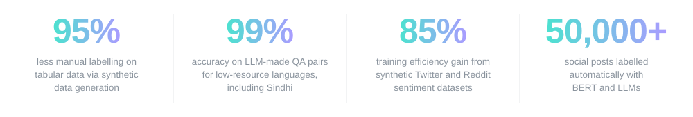
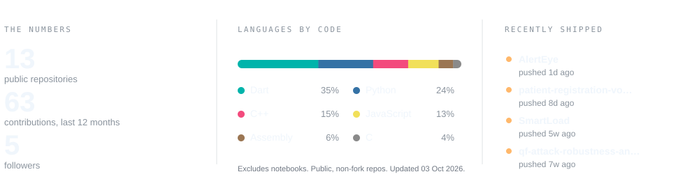

<a href="https://aimal-portfolio-xi.vercel.app/">
  <picture>
    <source media="(prefers-color-scheme: dark)" srcset="assets/hero-dark.svg">
    <source media="(prefers-color-scheme: light)" srcset="assets/hero-light.svg">
    
  </picture>
</a>

**[Portfolio](https://aimal-portfolio-xi.vercel.app/)** &nbsp;·&nbsp; [LinkedIn](https://linkedin.com/in/ak-dreambig) &nbsp;·&nbsp; [Medium](https://medium.com/@ak_dreambig) &nbsp;·&nbsp; [YouTube](https://youtube.com/@ak-dreambig) &nbsp;·&nbsp; [Hugging Face](https://huggingface.co/ak-dreambig) &nbsp;·&nbsp; [Discord](https://discord.gg/3TXeAN8tB) &nbsp;·&nbsp; [Email](mailto:aimalkhan9247@gmail.com)

 

I'm an AI engineer in Islamabad with two-plus years of building production systems across computer vision, document understanding and synthetic data.

Right now I'm at **XFlow Research**, designing modular OCR pipelines around vision-language models, and building face liveness and anti-spoofing for biometric verification. Before that I led the synthetic data team at **Bluescarf.ai**. On the side I write, run a community of builders, and take on research problems that interest me.

> *I build systems that learn, while staying curious about the questions those systems begin to ask us back.*

## Selected work

| Project | What it does | Built with |
|---|---|---|
| [**Patient Registration Voice Agent**](https://github.com/ak-dreambig/patient-registration-voice-agent) | A voice AI agent you can phone. It registers patients, validates their details server-side and saves them to PostgreSQL. Live dashboard and REST API included. | Vapi, GPT-4o-mini, FastAPI, PostgreSQL, Railway |
| [**QF-Attack Robustness Analysis**](https://github.com/ak-dreambig/qf-attack-robustness-analysis) | Reproduces a CVPR 2023 workshop attack on Stable Diffusion and extends it. Finding: INT8-quantized CLIP is an accidental defense, and attacks crafted for FP32 barely transfer to it. | PyTorch, CLIP, Stable Diffusion |
| [**Teaching Machines to Dream**](https://github.com/ak-dreambig/teaching-machines-to-dream) | A practical engineer's handbook on synthetic data, with 7 runnable notebooks covering tabular, text, image and document pipelines. | SDV, CTGAN, LLMs, Diffusion |
| [**SmartLoad**](https://github.com/ak-dreambig/SmartLoad) | Predicts a building's heating and cooling demand from early design parameters, and explains every prediction. | FastAPI, scikit-learn, SHAP, React |
| [**AlertEye**](https://github.com/ak-dreambig/AlertEye) | Final year project: a Flutter app that detects drowsy driving from the camera feed and phone motion sensors, and alerts the driver in real time. | Flutter, MobileNetV2, ConvLSTM2D, TFLite |

## Results

<picture>
  <source media="(prefers-color-scheme: dark)" srcset="assets/results-dark.svg">
  <source media="(prefers-color-scheme: light)" srcset="assets/results-light.svg">
  
</picture>

## What I work with

- **Languages:** Python, TypeScript, JavaScript, Dart, C++, C, Java
- **Vision and document AI:** OpenCV, PaddleOCR, TrOCR, vision-language models, Faster R-CNN, liveness and anti-spoofing
- **LLMs and NLP:** GPT-4, BERT, Whisper, Hugging Face, prompt engineering, fine-tuning
- **ML and data:** PyTorch, TensorFlow, scikit-learn, SHAP, Pandas, CTGAN, SMOTE, synthetic data pipelines
- **Shipping it:** FastAPI, React, Next.js, Flutter, PostgreSQL, Docker, AWS, Azure

## Writing and research

- **[Teaching Machines to Dream](https://github.com/ak-dreambig/teaching-machines-to-dream)**: an open handbook on synthetic data, written with Hamza Raziq Khan. The notebooks run free on [Kaggle](https://www.kaggle.com/work/collections/18158089).
- **[Characterization of Non-Linear Behaviour of Asphalt Concrete and Predictive Modeling](https://doi.org/10.5281/zenodo.17473396)**: an ANN trained on 6,082 experimental data points to predict resilient modulus, reaching R² above 0.90.
- **[QF-Attack write-up](https://github.com/ak-dreambig/qf-attack-robustness-analysis)**: reproduction, three-way attack comparison and a new quantization experiment.

## DreamBig Kaarwan

A community for people who like to build and learn in the open, rooted in the idea of moving together. Our first run, **AI Bootcamp Cohort 01: Foundation to Multimodal AI**, brought in 30+ participants.

[Join us on Discord](https://discord.gg/3TXeAN8tB)

## Activity

<picture>
  <source media="(prefers-color-scheme: dark)" srcset="assets/stats-dark.svg">
  <source media="(prefers-color-scheme: light)" srcset="assets/stats-light.svg">
  
</picture>

This card is generated by a small script and refreshed daily by [GitHub Actions](.github/workflows/stats.yml). No third-party widgets involved.

 

**Open to AI and computer vision roles, research collaborations and relocation.** The quickest way to reach me is [aimalkhan9247@gmail.com](mailto:aimalkhan9247@gmail.com) or [LinkedIn](https://linkedin.com/in/ak-dreambig).
